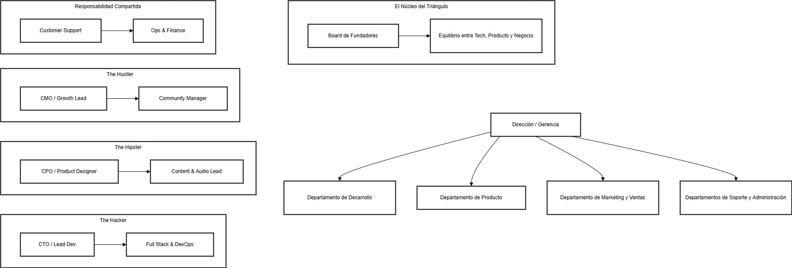

## Estructura organizativa de la empresa

### Definición de la estructura
En fases temrpanas tendriamos que adaptarnos como una Startup **Indie Hackers**, lo que se conoce como desarrolladores en equipo de 3 personas creando por pasión y monetizando los productos mediante la comunidad o los pagos únicos.  

Nos organizariamos por roles trabajando con el modelo **Triangulo de hierro** cubriendo todas los tres pilares fundamentales: tecnología, producto y negocio. Además en caso de decisiones tres personas nunca quedaran en empate.

### Identificación de departamentos y funciones

#### --- 1. Dirección / Gerencia (El Núcleo del Triángulo) ---
* **Board de Fundadores:** Los 3 líderes toman decisiones críticas por consenso. Equilibrio entre Tech, Producto y Negocio.

#### --- 2. Departamento de Desarrollo ("The Hacker") ---
* **CTO / Lead Dev:** Arquitectura de la plataforma.

* **Full Stack & DevOps:** Desarrollo de funcionalidades y automatización de despliegues.

#### --- 3. Departamento de Producto ("The Hipster") ---
* **CPO / Product Designer:** Diseño de mecánicas y experiencia de usuario (UX/UI).

* **Content & Audio Lead:** Supervisión de la calidad del contenido, assets sonoros y curaduría de la biblioteca de mastering.

#### --- 4. Departamento de Marketing y Ventas ("The Hustler") ---
* **CMO / Growth Lead:** Estrategias de adquisición de usuarios, monetización y alianzas con creadores de contenido TTRPG.

* **Community Manager:** Gestión de la comunidad (Discord, Redes).

#### --- 5. Departamentos de Soporte y Administración (Responsabilidad Compartida) ---
* **Customer Support:** Atención con escalado directo para bugs críticos.

* **Ops & Finance:** Gestión de recursos, suscripciones, legal y facturación, gestionada por el líder de Negocio.

### Organigrama estructural de la empresa  

### Justificación

* **Explicad por qué habéis elegido esa estructura.**  
Porque cubrimos todo lo necesario sin gastar en sueldos externos y además al ser número impar nunca se da un empate al tomar decisiones criticas.

* **¿Qué tamaño de equipo necesitaríais inicialmente?**  
Inicialmente los tres que somos. Tendríamos que ser en un principio "hombres orquesta" dedicandonos a todo entre todos. Más personas en el equipo solo ralentizaría la evolución y aumentaría costos.

* **¿Cómo escalaría la empresa con el tiempo?**  
En el inicio solo los fundadores lo hariamos todo.  
Más adelante contratariamos gente de Soporte de la comunidad para aligerar tiempo cuando no demos abasto. Y por último contratariamos especialistas para lo que nosotros no podamos abarcar.
