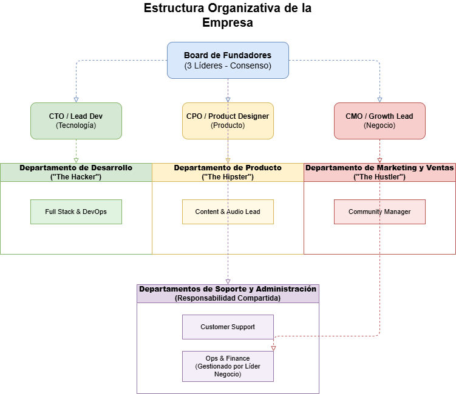

# Phase 1.1b): Organizational Structure
## Organizational Structure of the Company

### Definition of the Structure
In early phases, we would need to adapt ourselves as an **Indie Hackers** Startup, which is known as developers in a team of 3 people creating out of passion and monetizing products through the community or one-time payments.

We would organize ourselves by roles working with the **Iron Triangle** model covering all three fundamental pillars: technology, product, and business. Additionally, in case of decisions, three people will never end up in a tie.

### Identification of Departments and Functions

#### --- 1. Management / Direction (The Triangle Core) ---
* **Founders Board:** The 3 leaders make critical decisions by consensus. Balance between Tech, Product, and Business.

#### --- 2. Development Department ("The Hacker") ---
* **CTO / Lead Dev:** Platform architecture.

* **Full Stack & DevOps:** Feature development and deployment automation.

#### --- 3. Product Department ("The Hipster") ---
* **CPO / Product Designer:** Design of mechanics and user experience (UX/UI).

* **Content & Audio Lead:** Quality supervision of content, audio assets, and curation of the mastering library.

#### --- 4. Marketing and Sales Department ("The Hustler") ---
* **CMO / Growth Lead:** User acquisition strategies, monetization, and alliances with TTRPG content creators.

* **Community Manager:** Community management (Discord, Social Media).

#### --- 5. Support and Administration Departments (Shared Responsibility) ---
* **Customer Support:** Support with direct escalation for critical bugs.

* **Ops & Finance:** Resource management, subscriptions, legal and billing, managed by the Business leader.

### Department and Key Functions Table

| Department           | Main Functions                                                                |
|----------------------|-------------------------------------------------------------------------------|
| Management/Direction | Strategic decision-making, overall coordination, vision and mission           |
| Development          | Programming, architecture, deployment, technical maintenance                 |
| Product              | UX/UI design, feature definition, roadmap management                          |
| Marketing/Sales      | Acquisition strategies, campaigns, alliances, social media and community mgmt |
| Customer Service     | Support, issue resolution, user feedback                                      |
| Administration       | Finance, legal, billing, human resources                                      |

### Organizational Chart of the Company  

*The organizational chart has been created in draw.io to ensure clarity and visual professionalism.*

### Justification

* **Explanation of the structure choice.**  
The selected structure allows covering all key areas of the project without incurring additional costs from external hiring. Additionally, having an odd number of founding team members guarantees agility in decision-making and prevents possible deadlocks in critical situations.

* **What team size would you need initially?**  
In the initial phase, the team will be composed solely of the three founders, who will assume all necessary functions in a multifaceted manner for project development and management. Adding more people at this stage could slow progress and unnecessarily increase operating costs.

* **How would the company scale over time?**  
During the early stages, all tasks will be assumed by the founders. As the project grows and workload increases, we plan to incorporate support staff for the community, aiming to optimize user attention. Subsequently, specialists will be added in areas that require greater dedication or specific knowledge, ensuring sustainable and efficient growth.

As the company grows, each department will evolve as follows:

- Development: Specialists in frontend, backend, and QA will be incorporated, enabling greater specialization and quality in platform development.
- Product: The team will add UX/UI profiles and product analysts to optimize user experience and roadmap management.
- Marketing and Sales: Roles focused on analytics, paid campaigns (paid media), and international expansion will be added, enhancing user acquisition and retention.
- Customer Service: Will move from being a shared function to having a dedicated team, improving support speed and quality.
- Administration: Will grow to manage increased resources, legal and financial complexity, and talent management.

This evolution will maintain efficiency and quality as the project expands.

### Best Practices and Inspiration

The organizational structure of TabletopMastering has been designed based on best practices observed in successful tech startups. In the early stages, polyvalence and direct communication are prioritized, enabling agile and efficient decision-making. This approach is inspired by methodologies such as Lean Startup and the experience of "Indie Hackers" teams, where flexibility and adaptation are key.

As the project grows, a progressive evolution of teams is planned, incorporating specialized profiles only when workload and complexity require it. This strategy, recommended by industry leaders such as Eric Ries ("The Lean Startup") and Ben Horowitz ("The Hard Thing About Hard Things"), helps maintain operational efficiency and control costs.

Additionally, a culture of collaboration, continuous learning, and openness to feedback is encouraged, following the example of technology companies that have managed to grow sustainably and maintain motivated and committed teams.

These practices and references provide a solid foundation for the development and expansion of TabletopMastering, ensuring both work quality and the ability to adapt to new challenges.
